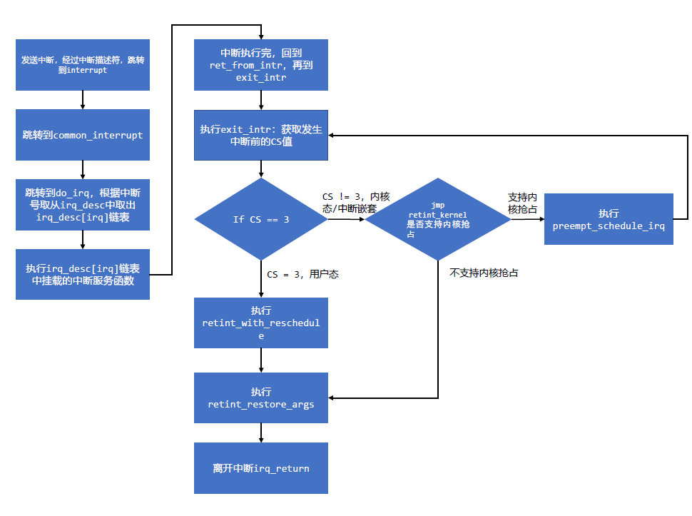

> 本文介绍x86_64体系结构中，使用汇编实现的中断处理部分，并对部分较陌生的指令进行解释，最后附上关于中断调用路径的流程图。

> 文章欢迎转载，但转载时请保留本段文字，并置于文章的顶部
> 作者：雨庭(rongwei)
> 本文原文地址：<http://wangrongwei.github.io{{ page.url }}>

## 环境 ##

配置source insight，支持汇编高亮和索引。
配置文件可加载[config_all.xml](https://github.com/wangrongwei/lazytools/tree/primer/sourceinsight)，关于source insight的配置方式和配置文件加载方式可参考[source insight](xxx)

## 汇编指令 ##

- [1] .rept与.endr：重复.rept与.endr间的代码若干份，其作用类似宏。其详细作用可参考ENTRY(interrupt)的描述。
- [2] <>：
- [3] .p2align：字节对齐
- [4] .balign：


## 重要函数 ##

### ENTRY(interrupt) ###

```S
    .section .init.rodata,"a"
ENTRY(interrupt)
    .section .entry.text
    .p2align 5
    .p2align CONFIG_X86_L1_CACHE_SHIFT
ENTRY(irq_entries_start)
    INTR_FRAME
vector=FIRST_EXTERNAL_VECTOR
.rept (NR_VECTORS-FIRST_EXTERNAL_VECTOR+6)/7
    .balign 32
  .rept 7
    .if vector < NR_VECTORS
      .if vector <> FIRST_EXTERNAL_VECTOR
    CFI_ADJUST_CFA_OFFSET -8
      .endif
1:  pushq_cfi $(~vector+0x80)   /* Note: always in signed byte range */
      .if ((vector-FIRST_EXTERNAL_VECTOR)%7) <> 6
    jmp 2f
      .endif
      .previous
    .quad 1b
      .section .entry.text
vector=vector+1
    .endif
  .endr
2:  jmp common_interrupt
.endr
```

以上汇编代码的目的是构建出224个interrupt成员函数，与以往内核版本不同（使用宏构建interrupt成员函数）。

### THREAD ###

thread_info结构体对task_struct进一步封装，但是以下代码如何获取到当前进程的thread_info的地址？


### .CFI_* ###

-[1] .cfi_sections section_list

**.cfi_sections**用于指定CFI触发的段是**.eh_frame** 或者是 **.debug_frame**，甚至同时包括以上两个。同时也可触发两个段，若后续的指示没有指定，默认为**.eh_frame**。

>**.cfi_sections** may be used to specify whether CFI directives should emit **.eh_frame** section and/or **.debug_frame** section. If section_list is **.eh_frame**, **.eh_frame** is emitted, if section_list is **.debug_frame**, **.debug_frame** is emitted. To emit both use **.eh_frame**, **.debug_frame**. The default if this directive is not used is **.cfi_sections** **.eh_frame**.

-[2] .cfi_startproc [simple]

**.cfi_startproc** is used at the beginning of each function that should have an entry in **.eh_frame**. It initializes some internal data structures. Don't forget to close the function by **.cfi_endproc**.

Unless **.cfi_startproc** is used along with parameter simple it also emits some architecture dependent initial CFI instructions.

-[3] .cfi_endproc

.cfi_endproc is used at the end of a function where it closes its unwind entry previously opened by .cfi_startproc, and emits it to .eh_frame.

-[4] .cfi_personality encoding [, exp]

.cfi_personality defines personality routine and its encoding. encoding must be a constant determining how the personality should be encoded. If it is 255 (DW_EH_PE_omit), second argument is not present, otherwise second argument should be a constant or a symbol name. When using indirect encodings, the symbol provided should be the location where personality can be loaded from, not the personality routine itself. The default after .cfi_startproc is .cfi_personality 0xff, no personality routine.

-[5] .cfi_lsda encoding [, exp]

.cfi_lsda defines LSDA and its encoding. encoding must be a constant determining how the LSDA should be encoded. If it is 255 (DW_EH_PE_omit), second argument is not present, otherwise second argument should be a constant or a symbol name. The default after .cfi_startproc is .cfi_lsda 0xff, no LSDA.

-[6] .cfi_def_cfa register, offset

.cfi_def_cfa defines a rule for computing CFA as: take address from register and add offset to it.

-[7] .cfi_def_cfa_register register

.cfi_def_cfa_register modifies a rule for computing CFA. From now on register will be used instead of the old one. Offset remains the same.

-[8] .cfi_def_cfa_offset offset

.cfi_def_cfa_offset modifies a rule for computing CFA. Register remains the same, but offset is new. Note that it is the absolute offset that will be added to a defined register to compute CFA address.

-[9] .cfi_adjust_cfa_offset offset

Same as .cfi_def_cfa_offset but offset is a relative value that is added/substracted from the previous offset.

-[10] .cfi_offset register, offset

Previous value of register is saved at offset offset from CFA.

-[11] .cfi_rel_offset register, offset

Previous value of register is saved at offset offset from the current CFA register. This is transformed to .cfi_offset using the known displacement of the CFA register from the CFA. This is often easier to use, because the number will match the code it's annotating.

-[12] .cfi_register register1, register2

Previous value of register1 is saved in register register2.

-[13] .cfi_restore register

.cfi_restore says that the rule for register is now the same as it was at the beginning of the function, after all initial instruction added by .cfi_startproc were executed.

-[14] .cfi_undefined register

表明寄存器的前一个值无法再被恢复。

>From now on the previous value of register can't be restored anymore.

-[15] .cfi_same_value register

寄存器的当前值与前一帧相同，即不需要恢复。

>Current value of register is the same like in the previous **frame**, i.e. no restoration needed.

-[16] .cfi_remember_state,

First save all current rules for all registers by **.cfi_remember_state**, then totally screw them up by subsequent **.cfi_\*** directives and when everything is hopelessly bad, use **.cfi_restore_state** to restore the previous saved state.

-[17] .cfi_return_column register

改变返回列寄存器，例如：返回地址是直接指向寄存器或者可以被访问。

>Change return column register, i.e. the return address is either directly in register or can be accessed by rules for register.

-[18] .cfi_signal_frame

标记当前的函数为信号蹦床

>Mark current function as signal trampoline.

-[19] .cfi_window_save

SPARC寄存器窗口已经被保存

>SPARC register window has been saved.

-[20] .cfi_escape expression[, ...]

允许用户添加任意字节到展开的信息。可以使用它来添加特定OS的CFI操作码，或者GAS还不支持的通用CFI操作码。

>Allows the user to add arbitrary bytes to the unwind info. One might use this to add OS-specific CFI opcodes, or generic CFI opcodes that GAS does not yet support.

-[21] .cfi_val_encoded_addr register, encoding, label

The current value of register is label. The value of label will be encoded in the output file according to encoding; see the description of .cfi_personality for details on this encoding.

The usefulness of equating a register to a fixed label is probably limited to the return address register. Here, it can be useful to mark a code segment that has only one return address which is reached by a direct branch and no copy of the return address exists in memory or another register.

>原文链接：http://sourceware.org/binutils/docs/as/CFI-directives.html

## 中断处理流程 ##

### 几个重要的函数 ###

- [1] common_interrupt

执行中断函数（do_irq），在do_irq中将会去执行其他的中断服务函数。

```S
    XCPT_FRAME
    addq $-0x80,(%rsp)  /* Adjust vector to [-256,-1] range */
    interrupt do_IRQ /* 中断函数 */
    /* 0(%rsp): old_rsp-ARGOFFSET */
```

- [2] ret_from_intr:

此处表明中断服务函数已经执行完成并返回。

```S
    DISABLE_INTERRUPTS(CLBR_NONE)
    TRACE_IRQS_OFF
    decl PER_CPU_VAR(irq_count)

    /* Restore saved previous stack */
    popq %rsi
    CFI_DEF_CFA rsi,SS+8-RBP    /* reg/off reset after def_cfa_expr */
    leaq ARGOFFSET-RBP(%rsi), %rsp
    CFI_DEF_CFA_REGISTER    rsp
    CFI_ADJUST_CFA_OFFSET   RBP-ARGOFFSET
```

- [3] exit_intr

判断发送中断前系统处于内核态还是用户态，根据两种不同的状态分别跳转到retint_kernel（内核态）或retint_with_reschedule（用户态）。

```S
    GET_THREAD_INFO(%rcx)
    testl $3,CS-ARGOFFSET(%rsp) /* 读取栈中的CS */
    je retint_kernel /* 若为内核态，则跳转 */
```

- [4] retint_with_reschedule

```S
    movl $_TIF_WORK_MASK,%edi
```S

- [5] retint_check

```S
    LOCKDEP_SYS_EXIT_IRQ
    movl TI_flags(%rcx),%edx
    andl %edi,%edx
    CFI_REMEMBER_STATE
    jnz  retint_careful /* 判断是否有其他需要做 */
```

在大多数情况下，以上[5]紧接[4]执行。

- [6] retint_swapgs

```S
/* return to user-space */
    /*
     * The iretq could re-enable interrupts:
     */
    DISABLE_INTERRUPTS(CLBR_ANY)
    TRACE_IRQS_IRETQ
    SWAPGS /* 切换gs */
    jmp restore_args
```

- [7] retint_restore_args

不支持内核抢占，且要返回内核态时，将在exit_intr中跳转到此处（因为retint_kernel已经被宏定义为retint_restore_args）。

```S
    DISABLE_INTERRUPTS(CLBR_ANY)
    /*
    * The iretq could re-enable interrupts:
    */
    TRACE_IRQS_IRETQ
```

- [8] restore_args:

```S
    RESTORE_ARGS 1,8,1
```

- [9] irq_return

执行到irq_return，表明中断服务函数、信号、是否重新调度等操作已经执行完，后续将跳转到中断前的状态执行。

### 中断框图 ###



