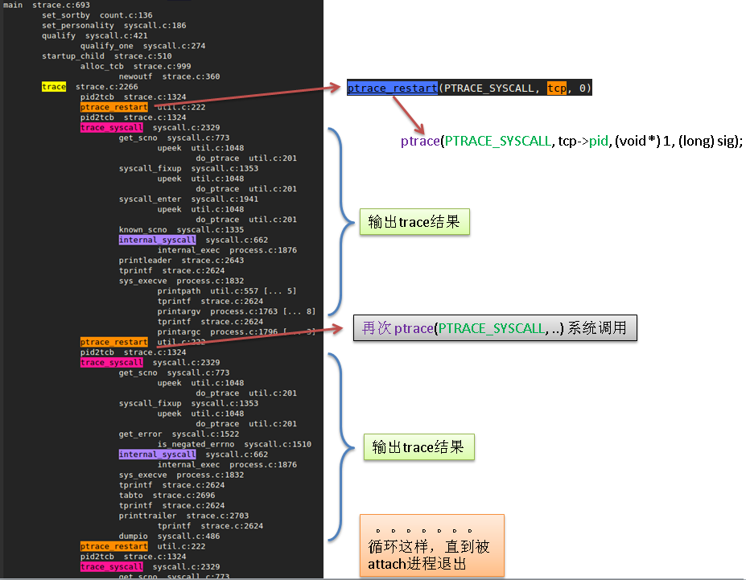

> 对strace代码的学习记录

> 文章欢迎转载，但转载时请保留本段文字，并置于文章的顶部
> 作者：雨庭(rongwei)
> 本文原文地址：<http://wangrongwei.github.io{{ page.url }}>

## strace

strace主要通过系统调用ptrace，利用父进程对子进程进行监控、控制、或对子进程数据进行修改。此外，ptrace跟踪信号的原理主要是：tracee（被跟踪进程）接收到所有信号（除SIGKILL）都会停止，触发tracer（跟踪进程）的wait回调。

```c
#include <sys/ptrace.h>

long ptrace(enum __ptrace_request request, pid_t pid, void *addr, void *data);
```

request参数说明：

请求执行的行为，可能选择有

- PTRACE_TRACEME：指示父进程跟踪某个子进程的执行。任何传给子进程的信号将导致其停止执行，同时父进程调用wait()时会得到通告。之后，子进程调用exec()时，核心会给它传送SIGTRAP信号，在新程序开始执行前，给予父进程控制的机会。pid, addr, 和 data参数被忽略。

以上是唯一由子进程使用的请求，剩下部分将由父进程使用的请求。

- PTRACE_PEEKTEXT, PTRACE_PEEKDATA：从子进程内存空间addr指向的位置读取一个字，并作为调用的结果返回。Linux内部对文本段和数据段不加区分，所以目前这两个请求相等。data参数被忽略。

- PTRACE_PEEKUSR：从子进程的用户区addr指向的位置读取一个字，并作为调用的结果返回。

- PTRACE_POKETEXT, PTRACE_POKEDATA：将data指向的字拷贝到子进程内存空间由addr指向的位置。

- PTRACE_POKEUSR：将data指向的字拷贝到子进程用户区由addr指向的位置。

- PTRACE_GETREGS, PTRACE_GETFPREGS：将子进程通用和浮点寄存器的值拷贝到父进程内由data指向的位置。addr参数被忽略。

- PTRACE_GETSIGINFO：获取导致子进程停止执行的信号信息，并将其存放在父进程内由data指向的位置。addr参数被忽略。

- PTRACE_SETREGS, PTRACE_SETFPREGS：从父进程内将data指向的数据拷贝到子进程的通用和浮点寄存器。addr参数被忽略。

- PTRACE_SETSIGINFO：将父进程内由data指向的数据作为siginfo_t结构体拷贝到子进程。addr参数被忽略。

- PTRACE_SETOPTIONS：将父进程内由data指向的值设定为ptrace选项，data作为位掩码来解释，由下面的标志指定

- PTRACE_O_TRACESYSGOOD：当转发syscall陷阱(traps)时，在信号编码中设置位7，即第一个字节的最高位。例如：SIGTRAP | 0x80。这有利于追踪者

### 一个简单例子

下面这个例子对父进程如何通过ptrace跟踪子进程进行了演示。该例子主要打印了子进程系统调用号。

```c
#include <stdio.h>
#include <unistd.h>
#include <sys/ptrace.h>
#include <sys/types.h>
#include <sys/wait.h>
#include <sys/reg.h>   /* For constants ORIG_RAX etc */
#include <sys/user.h>

int main(int argc, char *argv[])
{
	pid_t child;
	long orig_rax;
	int status;
	
	child = fork();
	if(child == 0){
   		/* 子进程 */
        ptrace(PTRACE_TRACEME,0,NULL,NULL);
		/* 执行一些函数，以便父进程对其进行跟踪 */
		printf("hello\n");
		write(1,"hello\n",6);
		execl("/bin/ls", "ls", "-a", NULL);
		exit(0);
	}
	
	while(1){
		wait(&status);
		/* 检测子进程是否正常退出 */
        	if(WIFEXITED(status)){ 
			break;
        	}
		struct user_regs_struct regs;
		ptrace(PTRACE_GETREGS, child, 0, &regs);
		long syscall = regs.orig_rax;
		fprintf(stdout, "%ld(%ld, %ld, %ld, %ld, %ld, %ld)\n",
		        syscall,
		        (long)regs.rdi, (long)regs.rsi, (long)regs.rdx,
		        (long)regs.r10, (long)regs.r8,  (long)regs.r9);
		ptrace(PTRACE_SYSCALL, child, 0, 0);
			
	}
	return 0;

}

```


## NOMMU_SYSTEM下为什么替换fork为vfork

>Systems that lack a MMU cannot use fork() to create the child process.

查看linux内核中fork代码，应该可以找到答案（在NOMMU系统中，fork会执行失败）。

```c
/* fork函数入口 */
int sys_fork(struct pt_regs *regs)
{
	return do_fork(SIGCHLD, regs->sp, regs, 0, NULL, NULL);
}

int sys_vfork(struct pt_regs *regs)
{
	return do_fork(CLONE_VFORK | CLONE_VM | SIGCHLD, regs->sp, regs, 0,
		       NULL, NULL);
}

```

根据以上fork与vfork的内核代码，可以发现两个系统调用仅仅在于：vfork多了CLONE_VFORK和CLONE_VM两个宏。





## 一些系统调用

这里记录在strace过程中遇到的库函数。

### strdup()

```c

#include <stdio.h>
#include <string.h>

int main(int argc, char *argv[])
{
    /* 内部使用的malloc为字符串分配空间 */
    char *s = strdup(argv[1]);
    printf("%s\n", argv[1]);

    return 0;
}

```

### wait和waitpid区分

在这里，较合适的说法应该是：等待子进程**状态**改变，其中包括：

- [1] 进程终止(terminated) WIFEXITED/WIFSIGNALED
- [2] 进程被信号停止(stopped by a signal) WIFSTOPPED
- [3] 进程恢复(resumed by a signal) WIFCONTINUED

### WIFEXITED与WEXITSTATUS区分

WIFEXITED只能判断子进程是否正常退出，WEXITSTATUS可以返回子进程退出时调用exit(n)中n的值。

